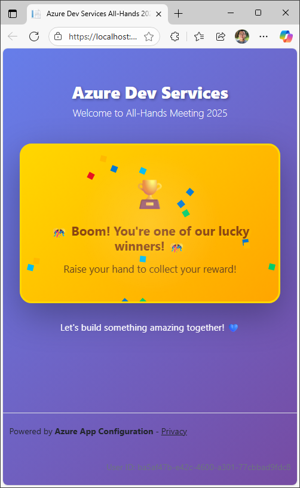
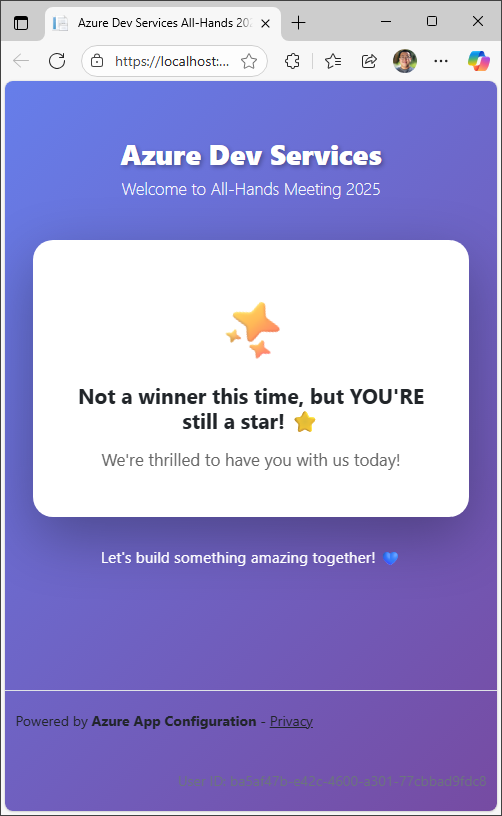
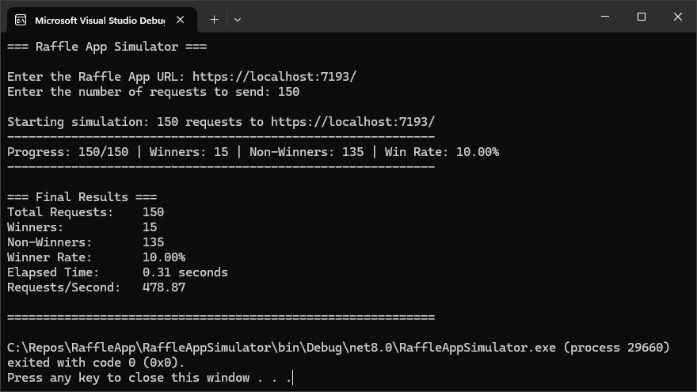
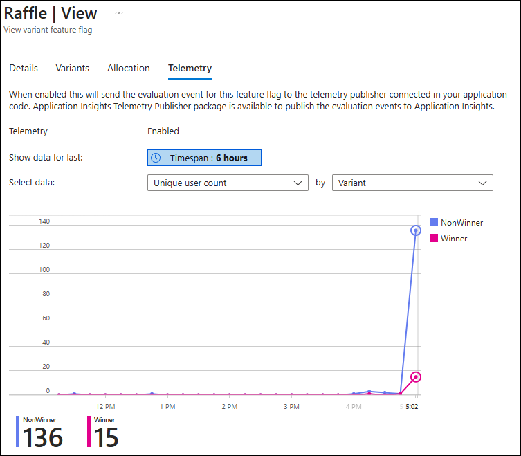

# Raffle App
This is a simple raffle application built with .NET 8.0 ASP.NET Razor pages.
It allows users to enter a raffle and randomly selects winners from the participants based on settings in a feature flag.
The application demonstrates how to use **Azure App Configuration** to control and monitor feature rollouts.

<div style="display: flex; gap: 10px;">
  
  
</div>

## Setup
1. Provision an App Configuration store and an Application Insights instance. Create following environment variables.

    ```bash
    AZURE_APPCONFIGURATION_ENDPOINT="The endpoint of your Azure App Configuration"
    APPLICATIONINSIGHTS_CONNECTION_STRING="The connection string of your Application Insights"
    ```

1. Navigate to your App Configuration store in the Azure portal. Select **Telemetry** -> **Application Insights** and link your Application Insights instance to the App Configuration store.

1. Navigate to **Operations** -> **Feature manager** in the Azure portal and create a feature flag named **Raffle** with the following configuration. This feature flag uses variant allocation to randomly distribute winners (10%) and non-winners (90%) among raffle participants. Make sure to enable telemetry to monitor the raffle progress.
    ```json
	{
		"id": "Raffle",
		"description": "Raffle for All-hands 2025",
		"enabled": true,
		"variants": [
			{
				"name": "Winner",
				"configuration_value": "🎊 Boom! You're one of our lucky winners! 🎊"
			},
			{
				"name": "NonWinner",
				"configuration_value": "Not a winner this time, but YOU'RE still a star! ⭐"
			}
		],
		"allocation": {
			"percentile": [
				{
					"variant": "Winner",
					"from": 0,
					"to": 10
				},
				{
					"variant": "NonWinner",
					"from": 10,
					"to": 100
				}
			],
			"default_when_enabled": "NonWinner",
			"default_when_disabled": "NonWinner"
		},
		"telemetry": {
			"enabled": true
		}
	}
   ```
## Simulation
To simulate multiple raffle entries, you can use the **RaffleAppSimulator** project included in the solution. This console application will send multiple requests to the Raffle App, simulating different users entering the raffle.



## Telemetry monitoring
Navigate to the **Telemetry** tab of the **Raffle** feature flag in the Azure portal to monitor the distribution of winners and non-winners in real-time.


